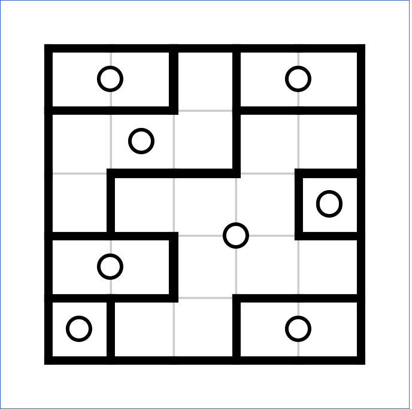

# Galaxies Puzzle Generator



### Puzzle Information
Galaxies also known as "Spiral Galaxies" or "Tentai Show" is a logic puzzle with simple rules and challenging solutions.

### Rules
You have to divide the grid into regions (galaxies) in such a way that:
- Each region has exactly 1 white circle in it, also known as a "center."
- The circle is the center of its rotational symmetry. In other words: If you rotate the region around the circle at 180° you should get the same shape, position and orientation.
- A region cannot be a neighbour to itself.

### How to use
To generate a single 5x5 puzzle, run the `main.go` file:
```
go run main.go
```

### How the algorithm works
First we take a width, height, and starting center count to begin. We create an array of `AvailableSpaces` that will be used to keep track of the spaces that we can either pick a `Center` from or spaces we can expand a `Galaxy` to.

We start by taking the starting center count and choosing 3 random spaces in our `AvailableSpaces` array, removing the ones we pick as well as any relevant adjacent spaces. 

Once the inital centers are chosen, we start to expand the galaxies out by picking a direction and checking if the mirrored direction is also available. We do this using a recursive depth first search, appending the selected cell and it's mirrored counterpart as well as unsetting all relavent spaces from the `AvailableSpaces` array.

Once we've exhausted all the starting centers, we reuse existing methods to choose a new center and expand it until our `AvailableSpaces` array is completely empty.

Finally, we go over each `Cell` of each `Galaxy` and create a "border" around the cells on the `Vertical` and `Horizontal` spaces to create our `Lines` array. This `Lines` array is how we can tell if a puzzle has been solved because we can check the sorted `Lines` array with a sorted array from the game. If they match, the puzzle is correclty solved.